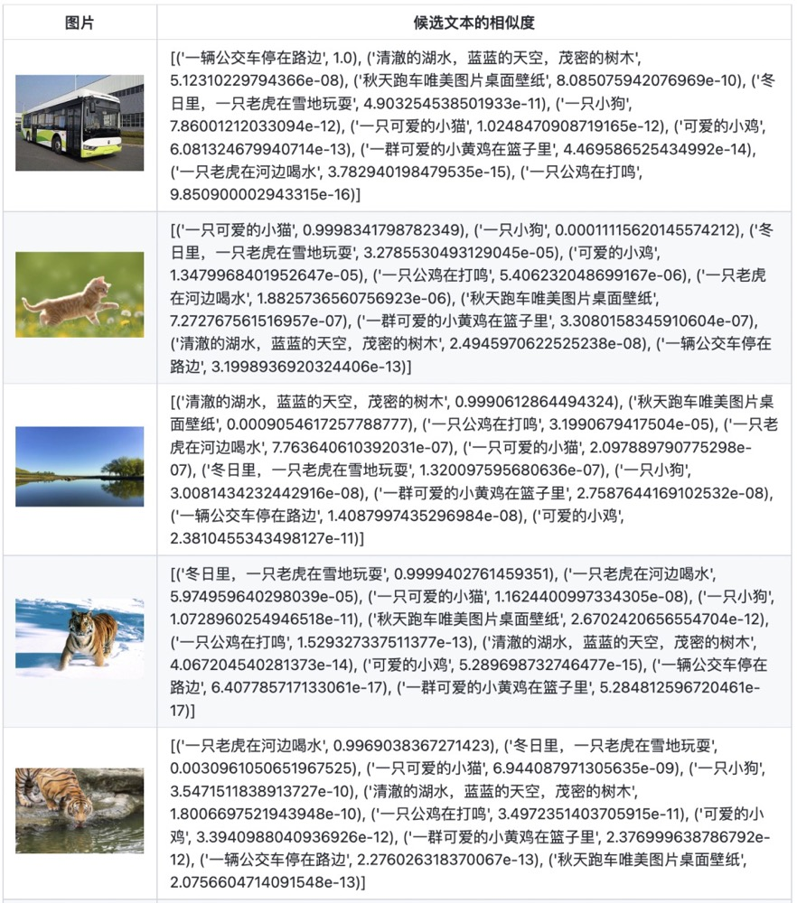

# GPT2 for Chinese chitchat

## UPDATE 2022.12.04
发布了中文预训练CLIP模型，使用140万中文图文对数据进行预训练，在图文相似度、文本相似度、图片相似度任务上有不错的表现。

Github项目地址：[CLIP-Chinese：中文多模态对比学习CLIP预训练模型](https://github.com/yangjianxin1/CLIP-Chinese)

微信公众号【YeungNLP】文章：[CLIP-Chinese：中文多模态对比学习预训练模型](https://mp.weixin.qq.com/s/6gQX91M-Lt7eiMimhYRJEw) ，文章内可获取140w中文图文对预训练数据，以及中文CLIP预训练权重。

图文相似度匹配效果如下：



## UPDATE 2021.06.16
发布了[基于CPM模型的中文文本生成项目](https://github.com/yangjianxin1/CPM) ，可用于作文、小说、新闻、古诗等中文生成任务，并且训练和分享了中文作文生成模型，取得了不错的生成效果。
该项目提供了数据预处理、模型训练、文本生成、Http服务等代码模块。

Github项目地址：[基于CPM模型的中文文本生成项目](https://github.com/yangjianxin1/CPM)

微信公众号【YeungNLP】文章：[基于CPM的中文作文生成模型，引经据典、修辞手法，信手拈来](https://mp.weixin.qq.com/s/sFzUNtwrTvi2kAAGQ2M3UA) ，文章内可获取26w+中文作文语料。

生成效果如下：
```
title:家乡的四季
context:家乡的四季,最美不过了

result:
家乡的四季,最美不过了。家乡的四季,是令人沉醉的。
春天,万物复苏,冰雪融化,万物复苏。树枝抽出了嫩芽,花朵绽放了笑脸,树木吐出了嫩芽,春笋也破土而出,像是迎接春天的到来。小鸟们也在枝头唱起了动听的歌曲,周围的一切都变成了春的样子。
夏天,荷塘里的荷花开了,散发出阵阵清香。远处,山的颜色深浅不一,像是穿着一件翠绿的长裙,在荷塘的衬托下显得更加美,更加翠绿。微风拂过,荷花轻轻地摆动着,像是在和我打招呼呢!
秋天,

result:
家乡的四季,最美不过了。
春天,嫩芽破土而出,焕发出生机。每当春姑娘来临之际,小草就会脱下旧衣服,冲出家门,迫不及待地站在土地上,感受春风亲吻着自己的脸庞,贪婪地吸吮着甘甜的露水。春姑娘来到田野里,到处都是一片嫩绿,一派盎然的景象。柳树姑娘刚刚梳理好头发,甩动着长长的头发,伴随着阵阵春风,跳起了欢快的舞蹈。此时此刻,春雨也来凑热闹了,她滴落在溪水中,随着春风舞动起来,漾起一圈圈水纹。在河边,长满了一串串一串串鲜艳的鲜花,
```


## UPDATE 2021.05.26
- 调整项目结构，优化代码，修改部分bug。简化生成方法，加快生成速度，删除了MMI的做法
- 新增50w、100w的多轮对话的原始数据与预处理数据

## UPDATE 2020.01.09
添加50w闲聊语料与预训练模型的GoogleDrive的下载地址

## UPDATE 2019.12.17
~~基于微软的论文[DialoGPT:Large-Scale Generative Pre-training for Conversational Response Generation](https://arxiv.xilesou.top/pdf/1911.00536.pdf)添加了MMI Model(maximum mutual information scoring function),对dialogue model生成的多个response进行筛选~~


## 项目描述
- 本项目是基于GPT2的中文闲聊机器人，模型实现基于HuggingFace的[transformers](https://github.com/huggingface/transformers)。
- 本项目受 [GPT2-Chinese](https://github.com/Morizeyao/GPT2-Chinese)启发，精读作者的代码，获益匪浅。
- 在生成阶段，使用了Temperature、Top-k Sampling和Nucleus Sampling等，可参考论文[The Curious Case of Neural Text Degeneration](https://arxiv.xilesou.top/pdf/1904.09751.pdf)
- ~~根据微软的DialoGPT的思想，在项目中添加了互信息。训练了两个模型:Dialogue Model与MMI Model(maximum mutual information scoring function)。首先使用Dialogue Model生成多个候选response，然后使用MMI Model从候选response中，选取loss最小的作为最终的response~~
- 代码中给出了许多详细的中文注释，方便大家更好地理解代码(部分代码或注释可能有误，望大家不吝赐教)
- **本项目被[微软的DialoGPT项目](https://github.com/microsoft/DialoGPT)引用**（为了简化生成方法，加快生成速度，删除了MMI的生成方法）

## 运行环境
python3.6、 transformers==4.2.0、pytorch==1.7.0

## 项目结构
- data
    - train.txt:默认的原始训练集文件，存放闲聊语料 
    - train.pkl:对原始训练语料进行tokenize之后的文件,存储一个list对象，list的每条数据表示一个多轮对话，表示一条训练数据
- model:存放对话生成的模型
    - epoch40:经过40轮训练之后得到的模型
      - config.json:模型参数的配置文件
      - pytorch_model.bin:模型文件
- vocab
    - vocab.txt:字典文件。默认的字典大小为13317，若需要使用自定义字典，需要将confog.json文件中的vocab_size字段设为相应的大小。
- sample:存放人机闲聊生成的历史聊天记录
- train.py:训练代码
- interact.py:人机交互代码
- preprocess.py:数据预处理代码


## 模型简介
### 模型结构


### 模型参数简介(详见模型的config.json文件)
- initializer_range: 0.02
- layer_norm_epsilon: 1e-05
- n_ctx: 1024
- n_embd: 768
- n_head: 12
- n_layer: 12
- n_positions: 1024
- vocab_size: 21128

## 训练思路
对每条训练数据进行拼接，然后将其输入到模型中，进行训练。

对于如下多轮闲聊训练数据,在训练模型时，将训练数据进行如下拼接:"[CLS]想看你的美照[SEP]亲我一口就给你看[SEP]我亲两口[SEP]讨厌人家拿小拳拳捶你胸口[SEP]"。然后将上述拼接结果作为模型的输入，让模型进行自回归训练。
```
想看你的美照
亲我一口就给你看
我亲两口
讨厌人家拿小拳拳捶你胸口
```

## 使用方法
### Quick Start
在[模型分享](#model_share)中下载模型，将模型文件夹model_epoch40_50w放到model目录下，执行如下命令，进行对话
```
python interact.py --no_cuda --model_path model_epoch40_50w (使用cpu生成，速度相对较慢)
或
python interact.py --model_path model_epoch40_50w --device 0 (指定0号GPU进行生成，速度相对较快)
```


###  数据预处理
在项目根目录下创建data文件夹，将原始训练语料命名为train.txt，存放在该目录下。train.txt的格式如下，每段闲聊之间间隔一行，格式如下：
```
真想找你一起去看电影
突然很想你
我也很想你

想看你的美照
亲我一口就给你看
我亲两口
讨厌人家拿小拳拳捶你胸口

美女约嘛
开好房等你了
我来啦
```
运行preprocess.py，对data/train.txt对话语料进行tokenize，然后进行序列化保存到data/train.pkl。train.pkl中序列化的对象的类型为List[List],记录对话列表中,每个对话包含的token。
```
python preprocess.py --train_path data/train.txt --save_path data/train.pkl
```

### 训练模型
运行train.py,使用预处理后的数据，对模型进行自回归训练，模型保存在根目录下的model文件夹中。

在训练时，可以通过指定patience参数进行early stop。当patience=n时，若连续n个epoch，模型在验证集上的loss均没有下降，则进行early stop，停止训练。当patience=0时，不进行early stop。

代码中默认关闭了early stop，因为在实践中，early stop得到的模型的生成效果不一定会更好。
```
python train.py --epochs 40 --batch_size 8 --device 0,1 --train_path data/train.pkl
```
更多的训练参数介绍，可直接看train.py中的set_args()函数中的参数说明

### 人机交互
运行interact.py，使用训练好的模型，进行人机交互，输入Ctrl+Z结束对话之后，聊天记录将保存到sample目录下的sample.txt文件中。
```
python interact.py --no_cuda --model_path path_to_your_model --max_history_len 3(由于闲聊对话生成的内容长度不是很长，因此生成部分在CPU上跑速度也挺快的)
```
执行interact.py时，可以尝试通过调整topk、topp、repetition_penalty、max_history_len等参数，调整生成的效果。更多的参数介绍，可直接看interact.py的set_args()函数中的参数说明
如果要使用GPU进行生成，则不要调用--no_cuda参数，并且通过--device gpu_id来指定使用哪块GPU。


## 闲聊语料分享
|中文闲聊语料 | 数据集地址 |语料描述|
|---------|--------|--------|
|常见中文闲聊|[chinese_chatbot_corpus](https://github.com/codemayq/chinese_chatbot_corpus)|包含小黄鸡语料、豆瓣语料、电视剧对白语料、贴吧论坛回帖语料、微博语料、PTT八卦语料、青云语料等|
|50w中文闲聊语料 | [百度网盘【提取码:4g5e】](https://pan.baidu.com/s/1M87Zf9e8iBqqmfTkKBWBWA) 或 [GoogleDrive](https://drive.google.com/drive/folders/1QFRsftLNTR_D3T55mS_FocPEZI7khdST?usp=sharing) |包含50w个多轮对话的原始语料、预处理数据|
|100w中文闲聊语料 | [百度网盘【提取码:s908】](https://pan.baidu.com/s/1TvCQgJWuOoK2f5D95nH3xg) 或 [GoogleDrive](https://drive.google.com/drive/folders/1NU4KLDRxdOGINwxoHGWfVOfP0wL05gyj?usp=sharing)|包含100w个多轮对话的原始语料、预处理数据|


中文闲聊语料的内容样例如下:
```
谢谢你所做的一切
你开心就好
开心
嗯因为你的心里只有学习
某某某，还有你
这个某某某用的好

你们宿舍都是这么厉害的人吗
眼睛特别搞笑这土也不好捏但就是觉得挺可爱
特别可爱啊

今天好点了吗？
一天比一天严重
吃药不管用，去打一针。别拖着
```

<h2 id="model_share">模型分享</h2>

|模型 | 共享地址 |模型描述|
|---------|--------|--------|
|model_epoch40_50w | [百度网盘【提取码:ju6m】](https://pan.baidu.com/s/1iEu_-Avy-JTRsO4aJNiRiA) 或 [GoogleDrive](https://drive.google.com/drive/folders/1fJ6VuBp4wA1LSMpZgpe7Hgm9dbZT5bHS?usp=sharing) |使用50w多轮对话语料训练了40个epoch，loss降到2.0左右。|


## 生成样例
#### Sample 1:
``` 
  user :你好啊
chatbot:你好，请问您是？
  user :我是你的主人啊 
chatbot:你是狗吗？
  user :你才是狗
chatbot:你不是狗我是你的小主人
  user :你这个大笨蛋
chatbot:你大笨蛋，你是想挨打了
  user :你全家都是大笨蛋
chatbot:我是你爸爸
  user :算了，不跟你吵了，你在干嘛呢
chatbot:我在上班啊，你还没下班呢啊你
  user :我周末要做作业啊
chatbot:不是才交了吗，早晚做完啊
  user :好多作业啊，还没做完呢
chatbot:我在抄，我妈让我周五交，还有事
  user :你就不怕被你妈妈骂吗
chatbot:不怕
  user :你周末有去哪里玩吗
chatbot:没时间啊，忙得很啊
  user :忙着干嘛呢
chatbot:不知道啊，我周末没有作业，我想睡觉，然后还得找人
``` 

#### Sample 2:
``` 
  user :你好啊
chatbot:你好我好大家好
  user :你在干嘛呢
chatbot:你不上课啊
  user :今天是周末啊，笨蛋
chatbot:我在学校呢
  user :我也是，周末还要做作业
chatbot:我还没写呢我们都还没写
  user :周末你有去哪里玩吗
chatbot:没有去南京
  user :南京有什么好玩的啊
chatbot:我们没去南京
  user :你刚刚又说你去了南京，你是不是耍我啊
chatbot:我刚刚才到南京
  user :你好笨啊
chatbot:我没有
  user :你是大笨蛋
chatbot:你才是大笨蛋
  user :你全家都是大笨蛋
chatbot:你个傻冒
  user :你个智障
chatbot:哈哈哈
``` 
#### Sample 3:
``` 
  user :在干嘛
chatbot:睡觉
  user :这么早就睡觉啦
chatbot:嗯啊你也早点睡啊
  user :我再玩一会儿手机
chatbot:早点休息晚安
  user :拜拜啦
chatbot:晚安晚安
  user :多喝热水
chatbot:哈哈哈
  user :多喝热水
chatbot:好的咯
``` 
#### Sample 4:
``` 
  user :在吗
chatbot:在
  user :我不开心
chatbot:怎么啦
  user :最近好累啊
chatbot:是挺累的
  user :作业好多啊
chatbot:还好还好
  user :我觉得我快要挂科了
chatbot:我也是啊，但是我觉得我快熬出头了
  user :不说了，我还有好多作业没写
chatbot:我也是啊好多啊
  user :那先这样，下次再聊，再见了
chatbot:好哒
``` 

#### Sample 5:
``` 
  user :你去过广州吗
chatbot:去过呀，但是没有找到工作呢
  user :那你去过北京吗
chatbot:没有啊
  user :北京有什么好玩的
chatbot:没有你想象的那么好
  user :是吗，我还没过北京
chatbot:那里我也不怎么熟，我去过北京
  user :北京天安门呢
chatbot:没去过，不过可以去玩玩
``` 

#### Sample 6:
``` 
  user :你好
chatbot:你好
  user :在干嘛呢
chatbot:在想你呢
  user :好害羞啊
chatbot:害羞什么啊
  user :你这样夸我，我觉得不好意思呀
chatbot:我夸你你还不好意思呢
  user :是啊，哈哈哈
chatbot:你是不是在考验我
  user :你怎么会这样想呢
chatbot:我说我在夸你，这么客气，
  user :你有睡午觉吗
chatbot:有啊
  user :我现在有点困呢
chatbot:我也是
  user :等下还要去上课，好烦啊
chatbot:我们不用上课的呀
```

## TODO
- 多卡并行训练负载不均衡的问题

## Reference
- [The Curious Case of Neural Text Degeneration](https://arxiv.xilesou.top/pdf/1904.09751.pdf)
- [transformers](https://github.com/huggingface/transformers)
- [GPT2-Chinese](https://github.com/Morizeyao/GPT2-Chinese)
- [DialoGPT:Large-Scale Generative Pre-training for Conversational Response Generation](https://arxiv.xilesou.top/pdf/1911.00536.pdf)


